# Alzheimer_Disease_Diagnosis

# An efficient Alzheimer’s Disease Diagnosis with fine-tuned Transfer Learning models

  

This work presents a reliable mechanism for early illness identification in the context of the worldwide healthcare difficulties brought on by Alzheimer’s disease. This work applies deep learning techniques using a large dataset of high-quality brain MRI images that includes people with Alzheimer’s disease and cognitively normal patients divided into 4 classes:

- Moderate Demented
  
- Mild Demented
  
- Very Mild Demented
  
- Non Demented

To create an automated diagnostic system, this work specifically use four transfer learning architectures—EfficientNetV2B3, InceptionNetV3, NASNetMobile and MobileNetV2 as base models. EfficientNetV2B3 which underwent thorough training and evaluation and was directed by important measures like loss and accuracy, ultimately showing a diagnostic accuracy of 96.72 %.

This dataset and model combination, supported by the Weights and Biases platform for real-time monitoring and metric logging, hold promise in advancing early Alzheimer’s disease detection and improving patient outcomes, addressing the significant societal and healthcare challenges
related to this condition. 

## Alzheimer's Disease and the importance of its early detection

Alzheimer's disease is a devastating and incurable neurodegenerative disorder that primarily affects the elderly, although early-onset cases can occur as well. It is the most common cause of dementia, responsible for significant cognitive and functional decline, and has a profound impact on individuals and their families. 

### Disease Prevalence

Alzheimer's disease is a widespread health concern, with an increasing global prevalence due to an aging population. The Alzheimer's Association estimates that over 6 million Americans are living with Alzheimer's disease, and this number is projected to rise significantly in the coming years. Worldwide, there are approximately 50 million people living with dementia, and this number is expected to triple by 2050.

### Timely Intervention

Early detection of Alzheimer's disease is vital because it allows for timely intervention. Although there is currently no cure for Alzheimer's, early diagnosis enables individuals to access available treatments and support services that can help manage the condition, alleviate symptoms, and improve the quality of life for both patients and their caregivers. As Alzheimer's disease is progressive, an early diagnosis helps individuals and their families with the opportunity to plan for the future.

## Dataset Description

The dataset used in this research work is titled as Alzheimer’s Dataset (S. Dubey). The research work was done on a total of aroung 6,400 images.
These are MRI images which are then further segregated into 4 classes. These 4 classes are Mild Demented, Moderate Demented, Non Demented and Very Mild Demented. Moderate Demented has 64 images, Mild Demented has 896 images, Very Mild Demented has 2240 images and Non Demented has 3200
images. The distribution of the dataset amongst these 4 classes is shown below:

The subsequent figure displays a set of sample images from the dataset processed by setting color maps as ”jet”. The ”jet” colormap is a rainbow-like colormap that maps numerical values to colors, transitioning through a range of colors from blue to red, with intermediate colors like green, yellow, and orange. It is often used to represent continuous data or gradients, where different colors represent different values or levels of a variable.

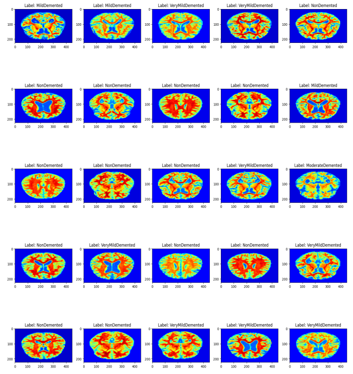

## Model Architecture 

We have used the tranfer learning models with adjustments made to the average pooling layer, flattening the fully connected layer, and applying the softmax function to an additional fully connected layer. Subsequently, hyperparameters were fine-tuned to optimize performance.
The architecture of the EfficientNetV2B3 is diagrammatically represented below:

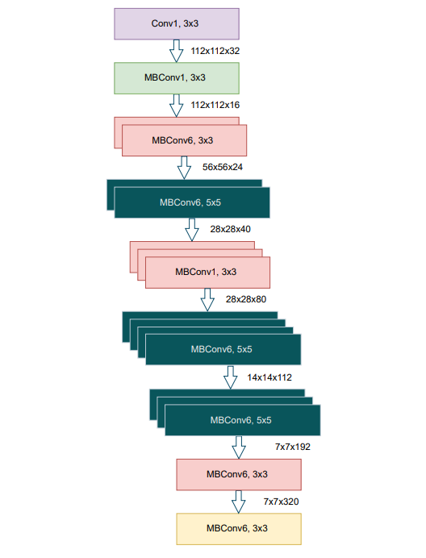

## Training and Evaluation

### Performance evaluation of different models

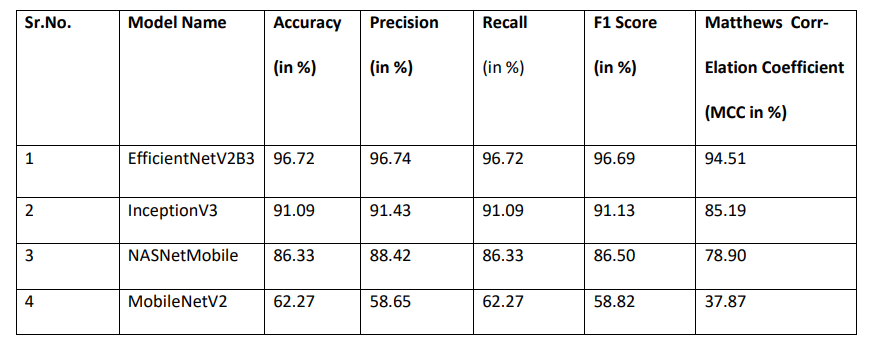

### EfficientNetV2B3

The model was trained over the training log of 21 epochs. The initial training accuracy stood at 53.9% and steadily increased to a robust 96.72% by the end of training. These results underscore the model’s excellent performance, characterized by high accuracy and minimal loss on both training and validation datasets, highlighting its capability to generalize and make precise predictions. The loss and accuracy curves are represented graphically below:

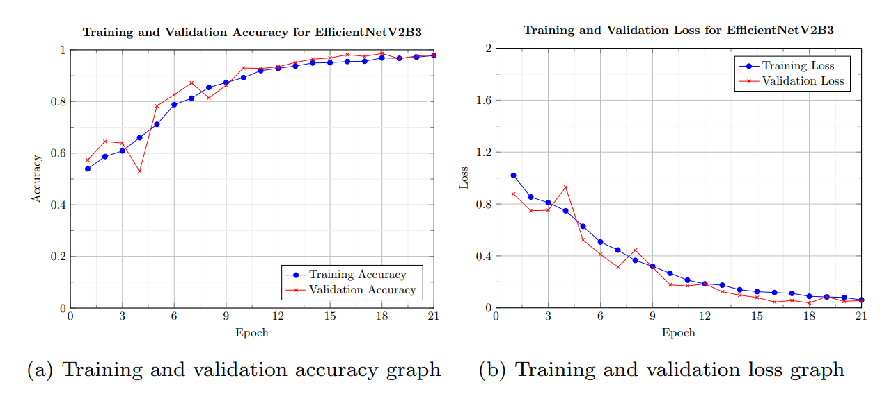

The confusion matrix below helps us understand the results better:

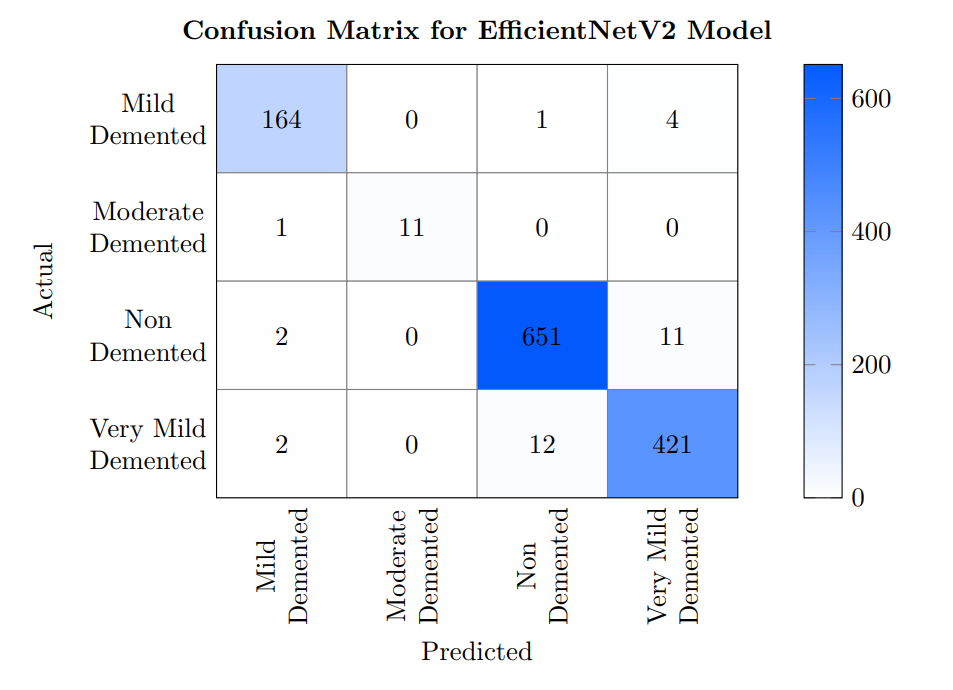

### InceptionV3

In the training process of the InceptionV3 model, a comprehensive evaluation over 31 epochs revealed notable progress. The model began with a training accuracy of approximately 53%, indicating that it had initially grasped some of the underlying patterns in the training. However, as the model continued to train it resulted in a validation accuracy of 92.9%. This consistentupward trend in validation accuracy underscores the model’s robustness and its capability to make accurate predictions on new, unseen data.

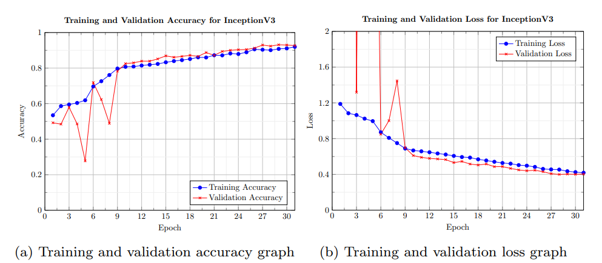

The confusion matrix below helps us understand the results better:

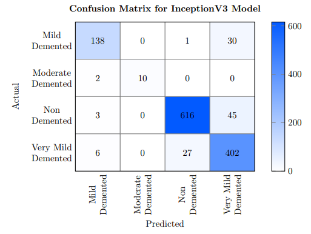

### MobileNetV2

At the outset, the model’s training accuracy stood at approximately 50.6%, indicating that it had started to grasp some patterns within the training data. However, as training continued, the model exhibited
a consistent upward trend in training accuracy, eventually reaching a levelof 63.6%.

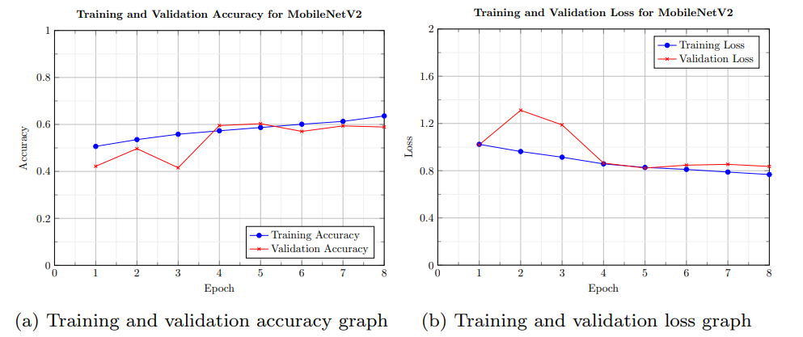

The confusion matrix below helps us understand the results better:

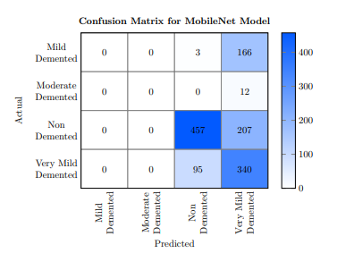

### NasNetMobile

During the training process of the NASNetMobile model, we tracked its performance over ten epochs. At the outset, the model exhibited a training accuracy of approximately 55.2%,as the training continued, the model displayed a consistent upward trend in training accuracy, culminating in an impressive 87.6% by the tenth epoch.

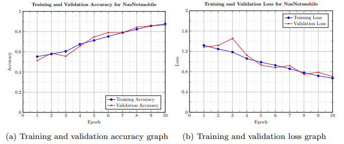

The confusion matrix below helps us understand the results better:

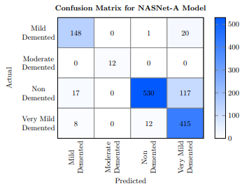

---
